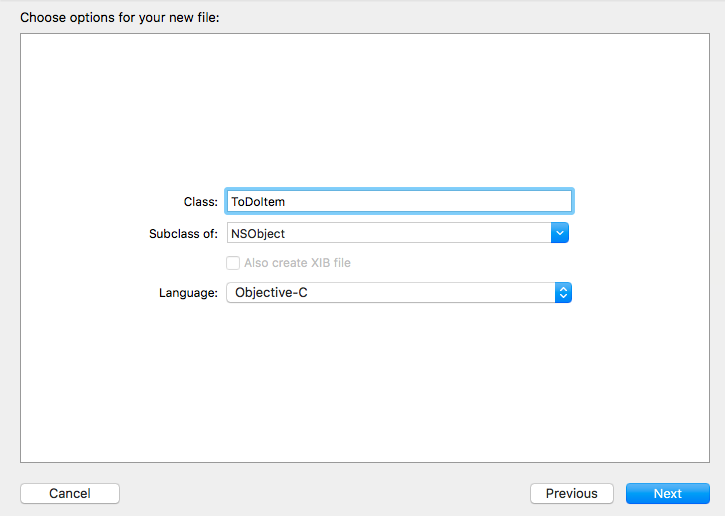

# 马上着手开发 iOS 应用程序

## 1. 项目基础
[参考](https://ltryee.gitbooks.io/start-developing-ios-apps-today-non-ib/content/tutorial_basics.html)

### 创建 ToDoList 项目
创建一个 iOS Single View Application 项目

### 创建第一个视图

创建一个标签(UILabel)

    //AppDelegate.m 中的application:didFinishLaunchingWithOptions: 方法

    self.window = [[UIWindow alloc] initWithFrame:[[UIScreen mainScreen] bounds]];
    self.window.backgroundColor = [UIColor whiteColor];
    [self.window makeKeyAndVisible];

    //Set Root View Controller
    self.window.rootViewController = [[UIViewController alloc]init];

    UILabel * label = [[UILabel alloc] initWithFrame:self.window.bounds];
    label.text = @"Hello, World!";
    label.textAlignment = NSTextAlignmentCenter;
    [self.window addSubview:label];

    return YES;

### 构建基本界面

创建一个UITextField，完整代码如下

    - (BOOL)application:(UIApplication *)application didFinishLaunchingWithOptions:(NSDictionary *)launchOptions {
    self.window = [[UIWindow alloc] initWithFrame:[[UIScreen mainScreen] bounds]];
    self.window.backgroundColor = [UIColor whiteColor];
    [self.window makeKeyAndVisible];

    //Set Root View Controller
    self.window.rootViewController = [[UIViewController alloc]init];

    UITextField * textField = [[UITextField alloc] initWithFrame:CGRectMake(20, 100, CGRectGetWidth(self.window.bounds) - 2 * 20, 30)];
    textField.placeholder = @"New to-do item";
    textField.borderStyle = UITextBorderStyleRoundedRect;
    [self.window addSubview:textField];

    return YES;
    }

## 2. 用户界面
[参考](https://ltryee.gitbooks.io/start-developing-ios-apps-today-non-ib/content/tutorialui.html)

### 设置UIViewAutoresizing

貌似iOS 8+ 默认就可以进行横竖屏大小缩放

### 创建第二个ViewController

1. 在ToDoList文件夹下建立 Cocoa Touch Class：ToDoItemTableViewController
2. 修改AppDelegate.m，给self.window.rootViewController赋值一个ToDoItemTableViewController类型的对象

### 创建 ToDoItem 类

[参考](https://ltryee.gitbooks.io/start-developing-ios-apps-today-non-ib/content/tutorialadddata.html)

1. 在ToDoList文件夹下建立 Objective-C Class(Cocoa Touch Class)：ToDoItem

    @interface ToDoItem : NSObject

    @property NSString *itemName;
    @property BOOL completed;
    @property (readonly) NSDate *creationDate;

    @end

## 3. 添加数据
[参考](https://ltryee.gitbooks.io/start-developing-ios-apps-today-non-ib/content/tutorialadddata.html)

### 创建 ToDoItem 类

1. 在ToDoList文件夹下建立 Objective-C Class(Cocoa Touch Class)：ToDoItem

